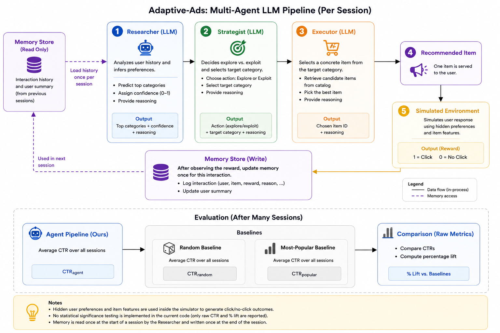

# Adaptive Ads

A simulated ad/item-serving environment where a multi-agent system (researcher,
strategist, executor) learns to personalize item recommendations from simulated
user click and dwell-time behavior — with every decision logged and explainable.

## Architecture



## Sample agent reasoning

| Function | Sample reasoning |
| --- | --- |
| `research_user()` | Electronics has the highest click-through rate (66.7%) with 3 impressions, providing more reliable data than home (100% CTR on 1 impression) or sports (0% CTR on 1 impression), though the sample size is still relatively small. |
| `plan_next_action()` | Confidence of 0.45 is below the threshold for exploitation, and impression count of 12 is limited. Exploring the 'home' category will help gather additional signal about user preferences and reduce uncertainty before committing to a single category strategy. |
| `serve_item()` | Item 3 is in the target electronics category and aligns with the exploit strategy to capitalize on the user's demonstrated strong preference for electronics. |

## Project structure

- `simulator/` — generates synthetic users, item catalog, and simulated impressions
- `agents/` — researcher, strategist, and executor agents
- `memory/` — SQLite-backed episodic + long-term memory store
- `eval/` — compares the agent pipeline's click-through rate against baselines
- `tests/` — unit tests

## Setup

```bash
python -m venv venv
source venv/bin/activate
pip install -r requirements.txt
```

Agents call Claude (`claude-haiku-4-5`) via the Anthropic API. Create a `.env`
file in the project root with your key:

```
ANTHROPIC_API_KEY=sk-...
```

## Generating simulation data

```bash
python -m simulator.simulate
```

Writes a synthetic population to `data/users.json` (100 users, each with a
hidden preference vector) and `data/catalog.json` (1000 items, each with a
category and feature vector). These are the ground-truth vectors the
simulator uses internally to decide clicks/dwell time — the agents never see
them directly, only the resulting interaction history.

## Running the evaluation

```bash
python -m eval.run_eval
```

Runs the random baseline, the most-popular baseline, and the full agent
pipeline over the same simulated users/catalog, then prints a comparison
report:

```
============================================================
EVAL REPORT
============================================================

Strategy: random
  Sessions: 5
  Clicks:   2
  CTR:      40.00%

Strategy: most-popular
  Sessions: 5
  Clicks:   0
  CTR:      0.00%

Strategy: agent_pipeline
  Sessions: 5
  Clicks:   1
  CTR:      20.00%
  Mode split: explore=5 exploit=0
  Token usage: 4085 in / 662 out

------------------------------------------------------------
Agent pipeline lift over baselines:
  vs random: -50.0%
  vs most-popular: n/a (baseline had 0 clicks)
============================================================
```

Each session makes 3 live API calls (researcher, strategist, executor), so
raising `n_sessions` scales cost accordingly. At small sample sizes the CTR
numbers are noisy — a single click swings CTR by `1/n_sessions`, so results
aren't meaningful until run at a larger scale.

## Testing

```bash
pytest
```

Agent and eval-harness tests run against a `FakeClient` test double (see
`tests/conftest.py`) that returns canned JSON payloads, so the suite runs
without hitting the live API.
